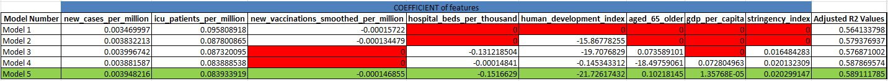

Rohit Raghuram Murarishetti - 1005398

Sanat Khandekar - 1005281

Ankita Parashar - 1005478

Ishan Monnappa Kodira - 1005284

**Introduction to our problem**  
With the serious impact Covid-19 has had on the world, resources to combat the
virus are scarce and hence detailed planning is crucial. Looking at the current
trend in the number of deaths worldwide, WHO needs to consider numerous factors
that are relative in each country which will determine the resource allocation.
To analyze this problem, we need to consider all the stakeholders, the 20
countries that are affected by Covid 19 and the role of WHO in assisting these
countries. However, because we are tasked to help WHO to make this model, we
will be mainly using the perspective of WHO to create this model. We would use a
multiple linear regression model which would make use of features like the
country’s new cases/million people, their new deaths/million people (to predict
future number of deaths/million), their number of ICU patients/million, the
number of hospital beds/thousand, the country’s Human Development Index (HDI),
their new vaccinations/million and lastly, the country’s stringency index. We
believe that this set of features will provide us with a robust analysis of our
dataset and make good predictions.

**New Cases/million and New Deaths/million**

A country’s new cases/million and new deaths/million are good indicatives of the
Covid-19 situation in the country and its severity. If there was a surge in the
number of cases or an increasing trend, by using a positive linear relationship,
we would expect a greater number of projected deaths in the future. Hence,
greater resources may need to be allocated to those countries.

**Number of ICU Patients/million**

The number of ICU patients/million in the country severity of the affected
patients who may need advanced and complicated treatments (e.g. oxygen masks,
ventilators) that could lead to a greater number of deaths.

**Number of Hospital Beds/thousand**

The number of hospital beds/thousand shows the country’s healthcare capacity and
capabilities and whether they would be able to handle a surge in the cases. If
their healthcare resources are inadequate, they are unlikely to be able to
manage the rise in cases which would lead to a greater number of patients not
getting the medical attention they require and hence will lead to a rise in the
deaths in that country.

**Human Development Index**

The Human Development Index of a country uses determinants such as the average
life expectancy at birth, the mean years of schooling an individual of ages
above 25 receives and the Gross National Income per capita. Using this as a
feature would show us how healthy an individual of the country is and hence, we
can assume how affected the country would be from Covid 19. The average years of
education in that country tells us how the population in general may react to
the surge in cases and how they take care of their personal hygiene. The GNI
signifies their average income in the country and whether they would be able to
afford medical needs and necessities in the time of a pandemic.

**Proportion of People above 65 years old**

Since Covid 19 has a history of impacting the elderly more, knowing the
proportion of people above 65 would help predict the number of deaths the
country might have.

**Number of Vaccinations/million**

The number of vaccinations per million will give the people of that country the
immunity to survive the virus and hence a country with a low vaccination rate
will have a greater death rate. It has been proven that vaccinations have a high
level of effectiveness in preventing Covid-19 deaths.

**Stringency Index**

Stringency index refers to the response of a country during an emergency using
nine response indicators which are school closures, workplace closures, travel
bans etc. The higher the value in the index, the greater and stricter the
precautionary measures in that country. A country with a high number of cases
but a low stringency index would lead to more people being at risk of the virus
and hence more possible deaths but a country with a high stringency index means
that the government has imposed strict rules for its citizens to protect them
and would be less vulnerable to the virus, leading to a lower number of deaths
in that country.

**Analysis**

Selection of model:

We tested multiple permutations using different number and selections of
features. Eventually we settled on Model 5 as it gave us the highest adjusted R2
value. From an observational perspective, these features also made sense as they
understandably affected number of deaths a day per million.

Selection of Adjusted R2 value:

Adjusted R2 is modified from R2 that is adjusted for number of
predictors/features in the models. It provides a more precise view of the
correlation by taking into account how many independent features are added to
the model.

Table 1: Table of coefficients for each feature in a multiple linear regression
equation along with their respective adjusted R\^2 values for every model

The following graphs are the linear regression graphs for each model to
visualize how accurate the equation derived is from the actual scatter plots
from our dataset.

Figure 1: Graph of Actual Number of Deaths a Day/million against the Predicted
Number of Death a Day/million along with the R\^2 value for Model 1 and 2

Figure 2: Graph of Actual Number of Deaths a Day/million against the Predicted
Number of Death a Day/million along with the R\^2 value for Model 3 and 4

Figure 3: Graph of Actual Number of Deaths a Day/million against the Predicted
Number of Death a Day/million along with the R\^2 value for Model 5

**Further Improvements:**

1.  Obtain more country specific variables from other datasets to improve our
    regression model.

2.  Clean the data further by removing outliers to give a more accurate
    prediction.

3.  Explore models such as neural networks to perform linear regression more
    accurately.

**Discussion and Conclusion**

We compare our results in Excel with that we obtained from our Python code.

|                   | Excel        | Python Code        |
|-------------------|--------------|--------------------|
|                   | 17.09922776  | 2.88068215         |
|                   | 0.003948216  | 1.12149337         |
|                   | 0.083933919  | 2.20116558         |
|                   | -0.000146855 | -0.2856093         |
|                   | -0.1516629   | -0.83180506        |
|                   | -21.72617432 | 0.2825699          |
|                   | 0.10218145   | 0.24247393         |
|                   | 1.35768E-05  | -0.50232241        |
|                   | 0.020299147  | 0.31034106         |
|  value            | 0.589631732  | 0.6137185056316705 |
| Adjusted value    | 0.589111785  | 0.6120920572343302 |
| Mean square error |              | 7.601756627277043  |

Mean square error is used to estimate how close the predicted values are to
actual values. Hence the lower the mean square error value, the closer the
predicted values to actual.

The reason for the large differences in the coefficients of the multiple linear
regression model could be due to the fact that in the python code, the features
columns for normalized while in Excel the raw data was used.

The slight difference can be accounted for 3 possible reasons:

-   The starting values for the coefficients in the gradient descent of the
    multiple linear regression could be different

-   The Excel algorithm could be using a different cost function

-   Excel could use regularization to prevent overfitting. Our python code does
    not have that.

However, it can be noted that the and the adjusted values for both the analysis
tools are close to each other. The python code predictions agree with the
multiple linear regression done by Excel.
